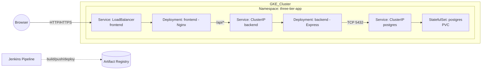

## Three-tier Architecture on GKE

### Architecture diagram

The browser talks to the public `LoadBalancer` service for the frontend, which serves the static UI and proxies `/api/*` to the backend service. The backend connects to PostgreSQL via the cluster-internal `ClusterIP` service. Jenkins builds and pushes Docker images to Artifact Registry and applies Kubernetes manifests to update deployments.
