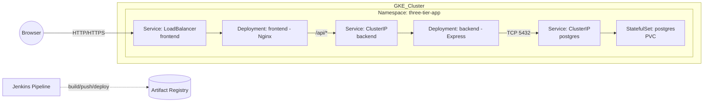

## Three-tier Application on GKE (Terraform + Jenkins)

This repository contains a complete three-tier sample application:

- **Presentation layer**: Nginx serving a static UI and reverse-proxying `/api/*` to the backend
- **Application layer**: Node.js (Express) REST API
- **Data layer**: PostgreSQL running as a StatefulSet

Infra is provisioned with **Terraform** (GKE cluster, VPC/Subnet, Artifact Registry). CI/CD uses **Jenkins** to build/push Docker images and deploy manifests to the cluster.

### Repository layout

- `frontend/`: Static HTML app served by Nginx; reverse proxy to backend within the cluster
- `backend/`: Node.js Express API that talks to PostgreSQL
- `k8s/`: Kubernetes manifests (namespace, postgres, backend, frontend)
- `terraform/`: Terraform to provision GKE + VPC + Artifact Registry
- `Jenkinsfile`: Jenkins pipeline to build → push → deploy

### Architecture diagram



The browser talks to the public `LoadBalancer` service for the frontend, which serves the static UI and proxies `/api/*` to the backend service. The backend connects to PostgreSQL via the cluster-internal `ClusterIP` service. Jenkins builds and pushes Docker images to Artifact Registry and applies Kubernetes manifests to update deployments.

## 1) Prerequisites

- A GCP project with billing enabled
- CLI tools installed on your workstation/agents:
  - `gcloud`, `kubectl`, `terraform` (>= 1.4), `docker`
- A Jenkins controller/agent with Docker (to build images) and gcloud SDK
- Service Account (JSON key) for Jenkins with roles sufficient to:
  - `roles/container.admin` (or `roles/container.clusterAdmin` + `roles/container.developer`)
  - `roles/artifactregistry.writer`
  - `roles/viewer`
  - Optional: `roles/storage.admin` if you plan to use GCS extensively

## 2) Provision infrastructure with Terraform

1. Authenticate locally for Terraform:

   ```bash
   gcloud auth application-default login
   gcloud config set project YOUR_PROJECT_ID
   ```

2. Edit variables (if needed) in `terraform/variables.tf`. Required input:
   - `project_id`: your GCP project ID
3. Run Terraform:

   ```bash
   cd terraform
   terraform init
   terraform apply -var="project_id=YOUR_PROJECT_ID"
   ```

   Outputs include the cluster name/location and Artifact Registry base path.

Notes:

- The cluster is created as a REGIONAL cluster in `var.region` (default `us-central1`).
- Artifact Registry repository (Docker) is created in the same region.

## 3) Build & deploy with Jenkins

### Create Jenkins credentials

Create the following credentials in Jenkins:

- ID: `gcp-sa` (Kind: Secret file). Upload the GCP Service Account JSON key.
- ID: `db-credentials` (Kind: Username with password). Example:
  - Username: `appuser`
  - Password: strong random password (e.g., from your secret manager)

### Configure and run the pipeline

The `Jenkinsfile` expects parameters:

- `GCP_PROJECT`: your project (e.g., `my-prod-project`)
- `REGION`: e.g., `us-central1`
- `ZONE`: e.g., `us-central1-a` (not used by regional cluster but kept for clarity)
- `CLUSTER_NAME`: default `three-tier-gke`
- `AR_REPO`: default `three-tier-repo`
- `NAMESPACE`: default `three-tier-app`

Pipeline stages will:

1. Authenticate to GCP, configure Docker to push to Artifact Registry, fetch GKE credentials.
2. Build Docker images for `backend` and `frontend` and push them to Artifact Registry:
   - `${REGION}-docker.pkg.dev/${GCP_PROJECT}/${AR_REPO}/backend:${BUILD_NUMBER}`
   - `${REGION}-docker.pkg.dev/${GCP_PROJECT}/${AR_REPO}/frontend:${BUILD_NUMBER}`
3. Apply Kubernetes manifests and set the deployment images to the new tags.
4. Wait for rollouts to complete.

After a successful run, the `frontend` Service will be of type `LoadBalancer`.

## 4) Kubernetes manifests overview

All resources live in the namespace `three-tier-app`:

- `k8s/namespace.yaml`: namespace
- `k8s/postgres/*`:
  - `configmap-initdb.yaml`: creates `items` table on first DB init
  - `service.yaml`: ClusterIP service for Postgres
  - `statefulset.yaml`: Single-replica Postgres with PVC
  - Secret `db-credentials` is created by the Jenkins pipeline with keys:
    - `POSTGRES_USER`, `POSTGRES_PASSWORD`

- `k8s/backend/*`:
  - `deployment.yaml`: Express API, uses env `PG*` vars from Secret and cluster DNS for Postgres
  - `service.yaml`: ClusterIP service for backend

- `k8s/frontend/*`:
  - `deployment.yaml`: Nginx serves static UI and proxies `/api/*` to `backend:8080`
  - `service.yaml`: LoadBalancer to expose the app publicly

## 5) Verifying the deployment

1. Get the external IP for the frontend service:

   ```bash
   kubectl -n three-tier-app get svc frontend
   ```

2. Open the EXTERNAL-IP in your browser. You should see the UI.
3. Add an item using the form; you should see it appear in the list (stored in Postgres).

Troubleshooting tips:

- Check backend health:

  ```bash
  kubectl -n three-tier-app get pods
  kubectl -n three-tier-app logs deploy/backend
  kubectl -n three-tier-app exec deploy/postgres -- psql -U "$POSTGRES_USER" -d appdb -c '\dt'
  ```

- If images fail to pull, ensure Jenkins configured `gcloud auth configure-docker` for `${REGION}-docker.pkg.dev` and the images were pushed.
- Ensure the compute region for GKE and Artifact Registry match (pipeline assumes same region).

## 6) Local development notes (optional)

- Backend can run locally with a local Postgres by setting `PG*` env vars. Default port is `8080`.
- Frontend is static; you can serve `frontend/www/` via any static HTTP server for local testing and point `/api/*` to a local backend or change `nginx.conf` and rebuild the Docker image.

## 7) Clean up

To delete GKE and related infra created by Terraform:

```bash
cd terraform
terraform destroy -var="project_id=YOUR_PROJECT_ID"
```

## License

Apache License 2.0
